# Bugfix — Diagramy diagnostyczne i poprawki

## BUG 1 — Panele Add Project / Add Employee nie otwierają się

### Diagnoza

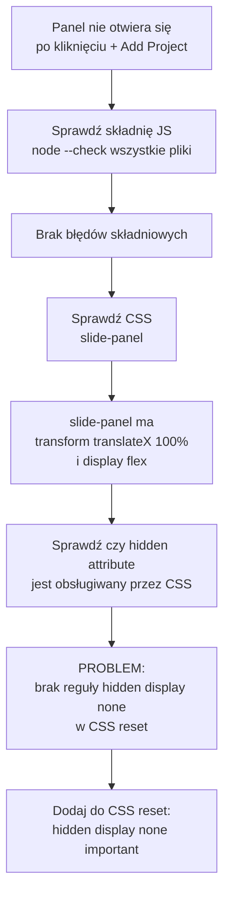

### Przyczyna

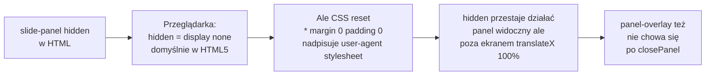

### Naprawa

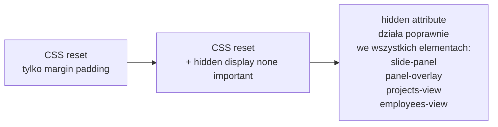

---

## BUG 2 — Seed Data nie działa / pokazuje błędne income

### Diagnoza

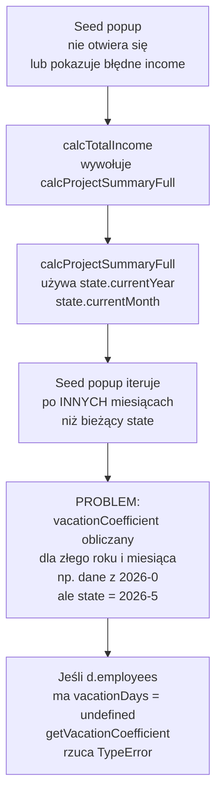

### Przyczyna — dwa problemy naraz

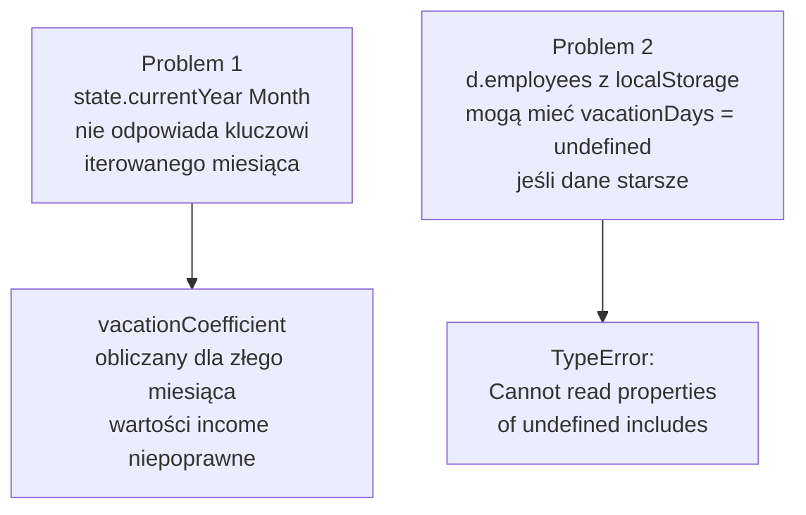

### Naprawa — dwie poprawki

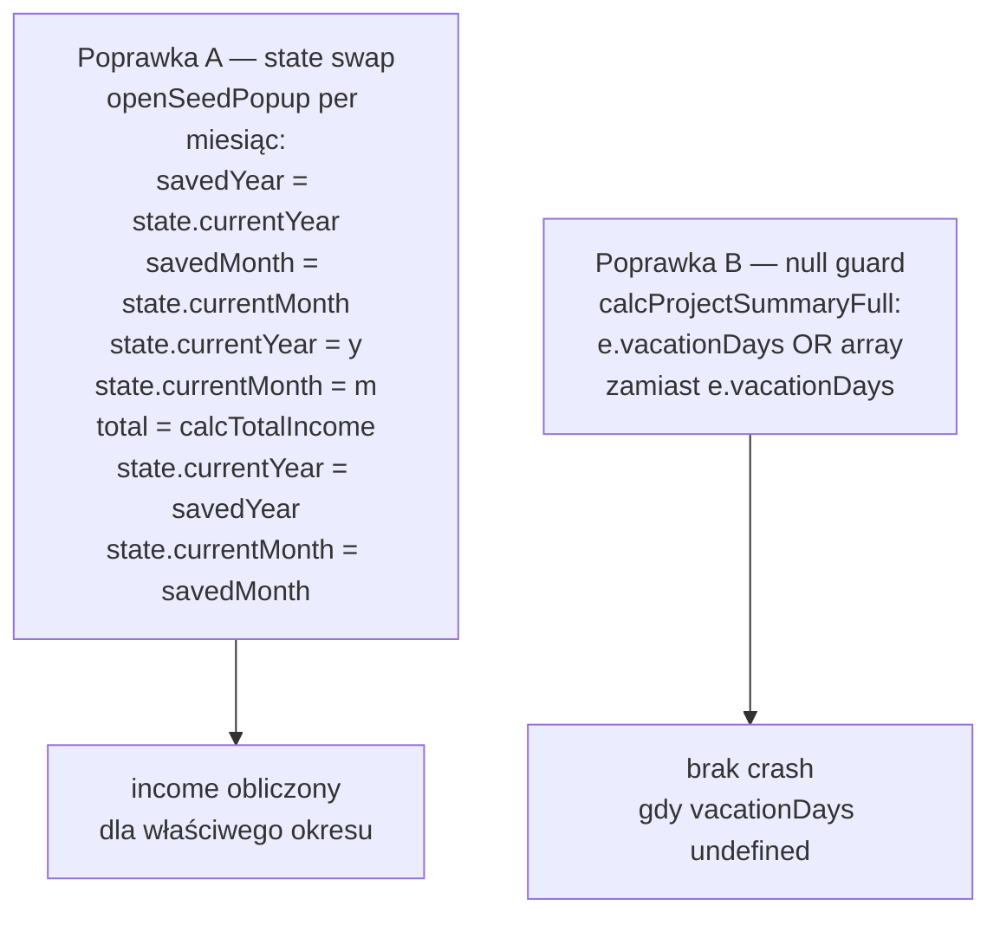

---

## BUG 3 — td.actions psuje layout tabeli

### Diagnoza

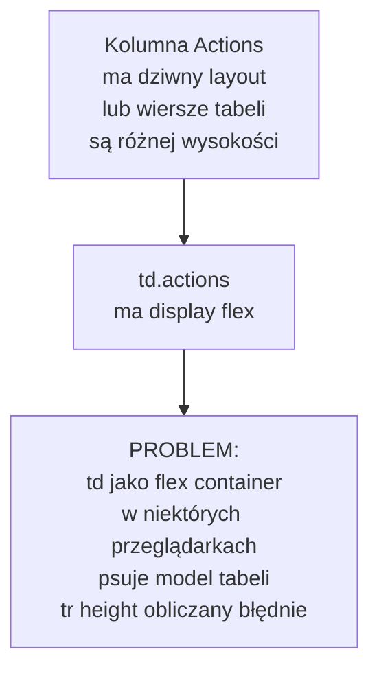

### Naprawa

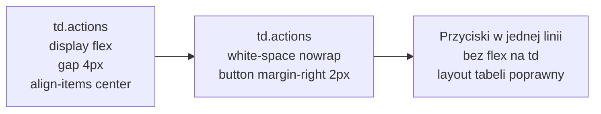

---

## BUG 4 — Ikony sortowania resetują się po re-renderze

### Diagnoza

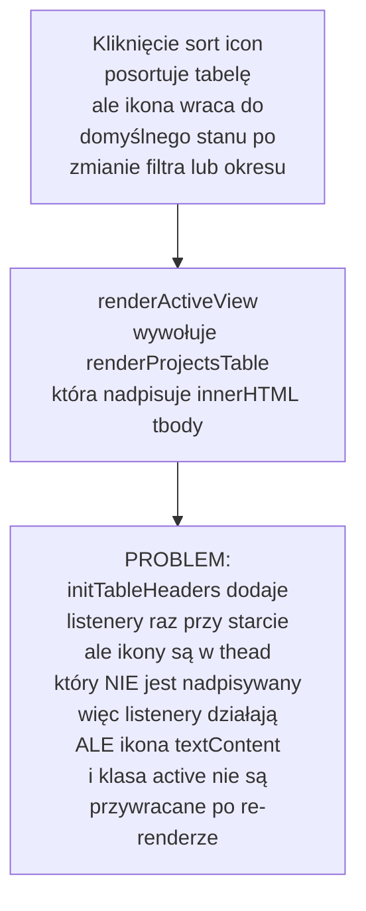

### Naprawa — restoreSortIcons

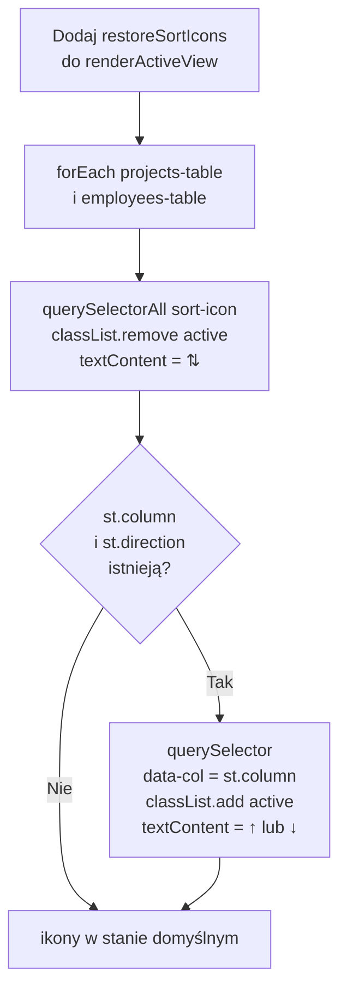

---

## Podsumowanie — mapa wszystkich bugów i poprawek

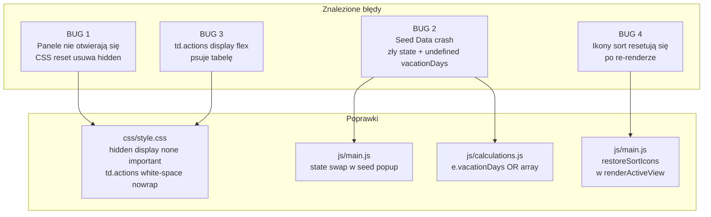
