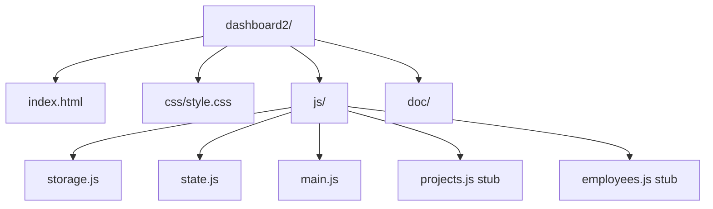
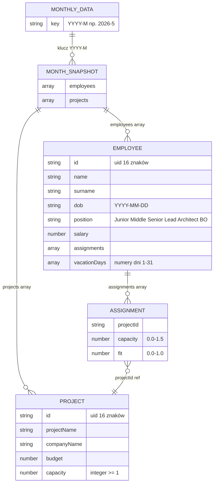
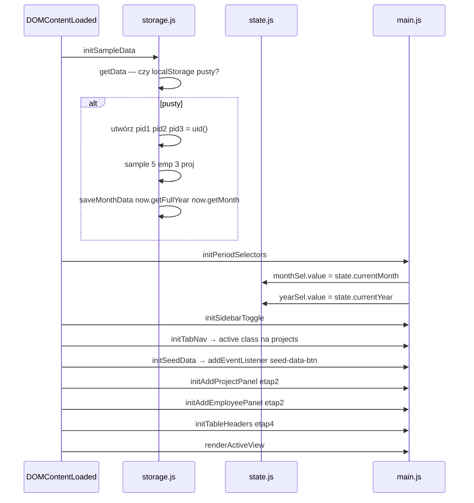
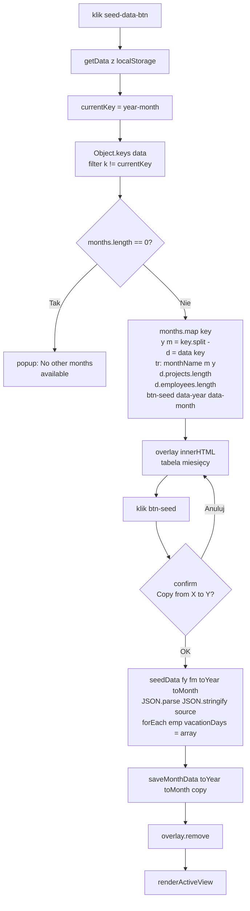
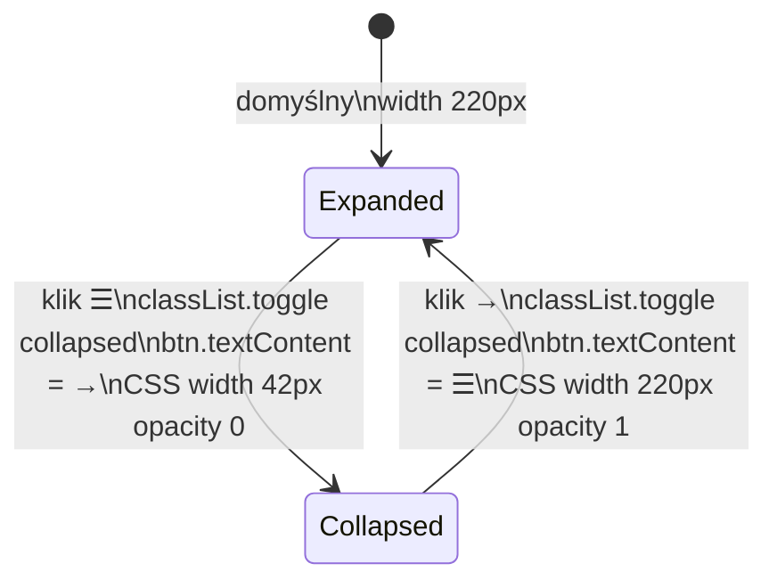
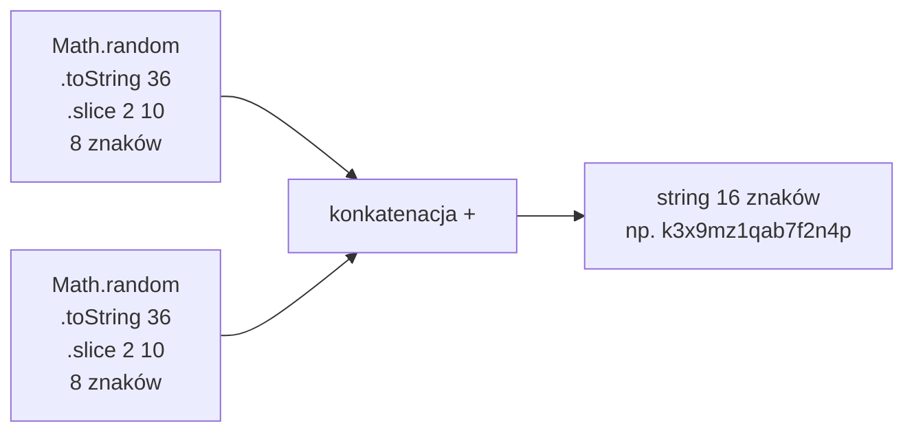
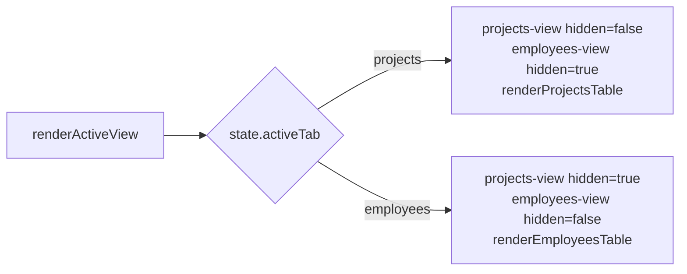

# Etap 1 — Diagramy z implementacji

## 1. Struktura plików (rzeczywista po etapie 1)

## 2. Model danych localStorage

## 3. DOMContentLoaded — sekwencja inicjalizacji

## 4. Seed Data — szczegółowy przepływ

## 5. Sidebar toggle

## 6. uid() — generator

## 7. renderActiveView

