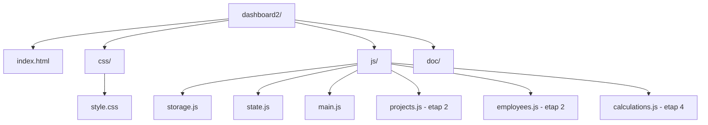
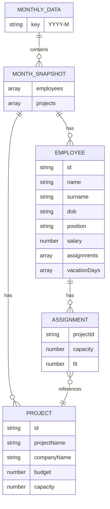
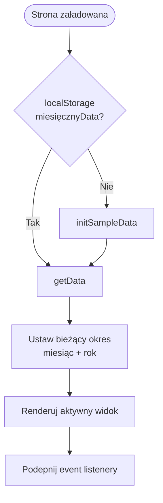
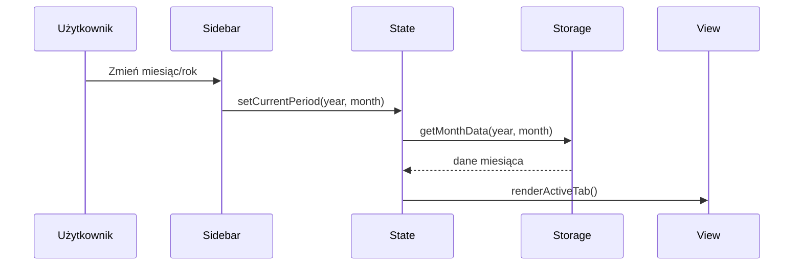
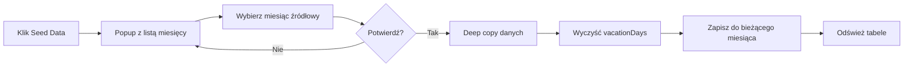
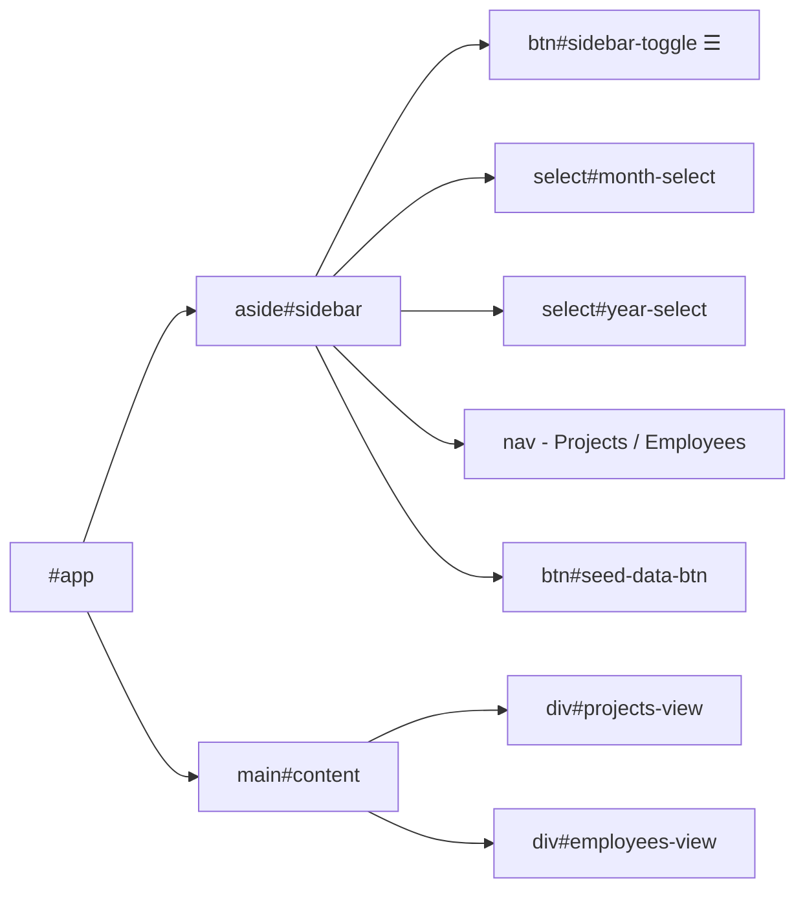

# Etap 1 — Diagramy Mermaid

## 1. Struktura plików projektu

## 2. Model danych localStorage

## 3. Inicjalizacja aplikacji

## 4. Zmiana okresu (miesiąc/rok)

## 5. Seed Data — przepływ

## 6. Layout aplikacji

