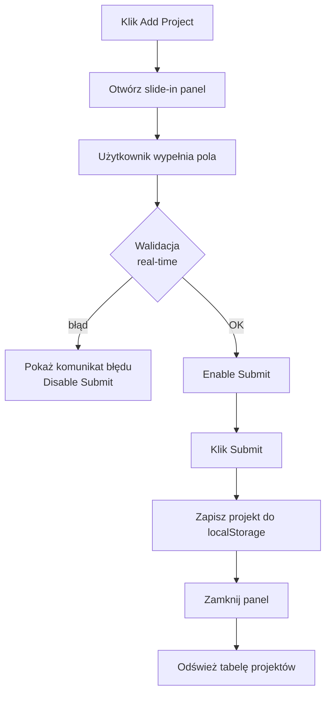
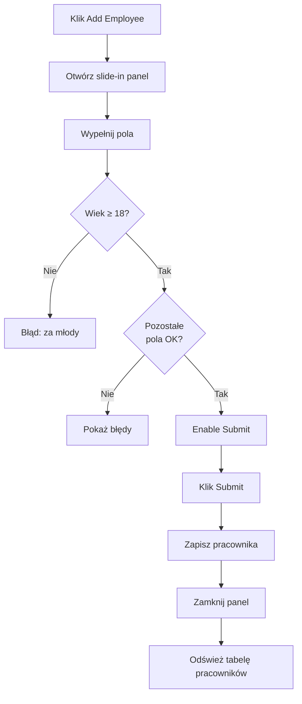
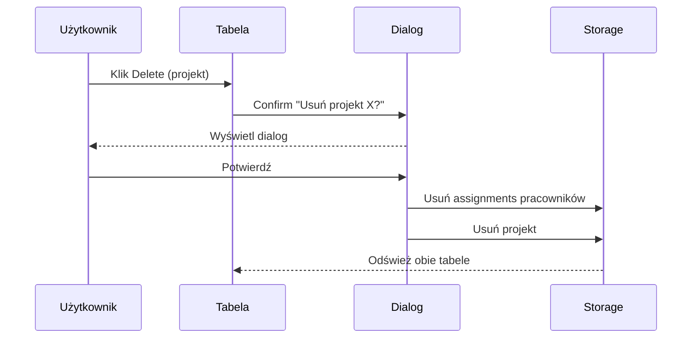
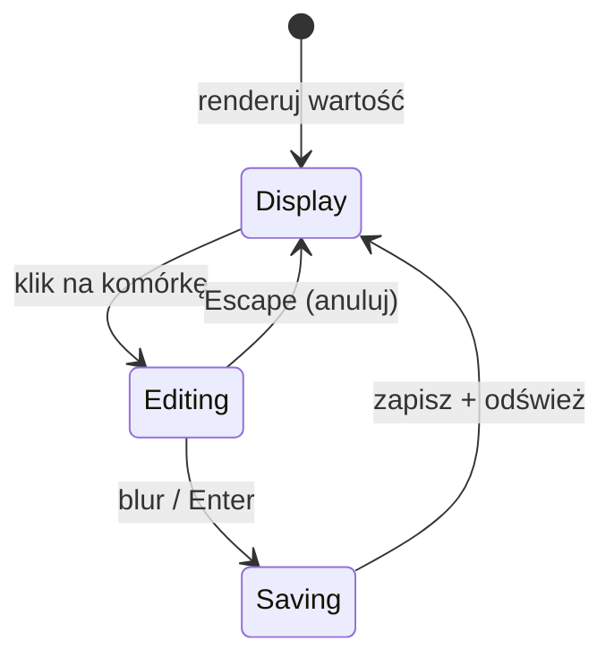
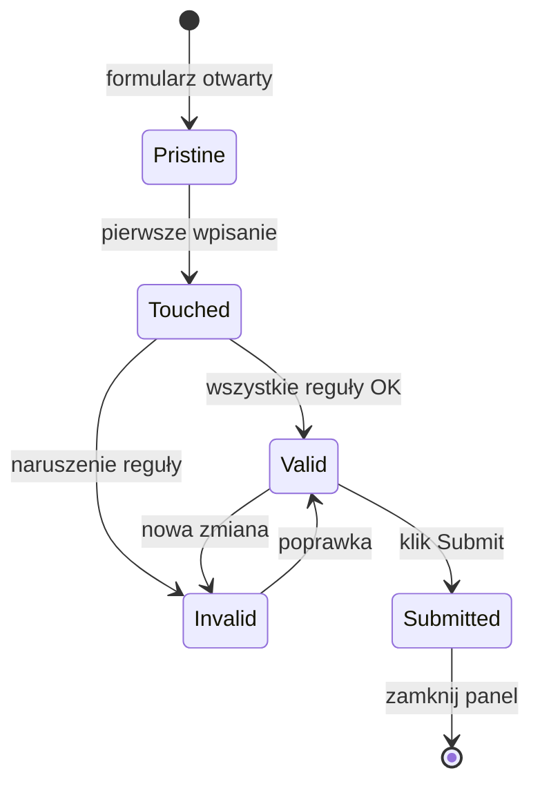
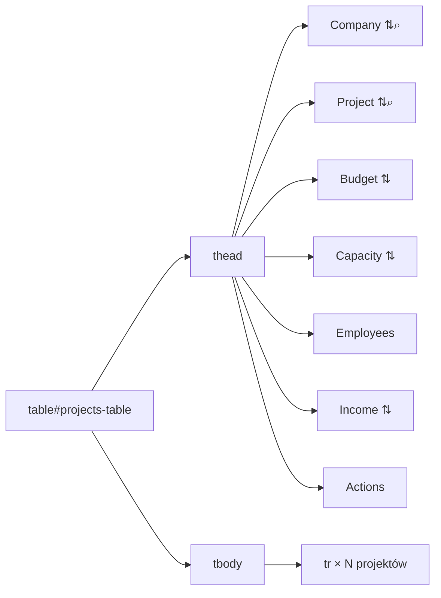
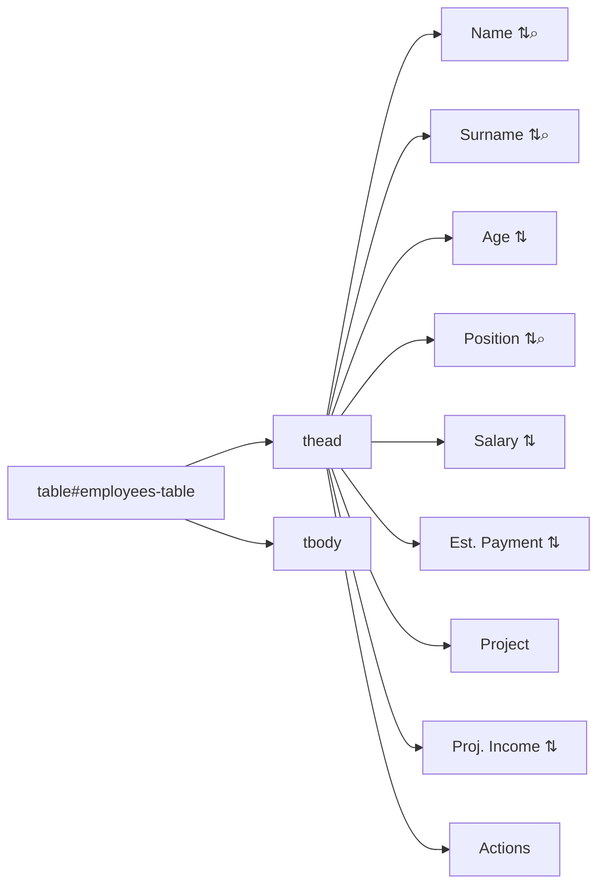

# Etap 2 — Diagramy Mermaid

## 1. Przepływ dodawania projektu

## 2. Przepływ dodawania pracownika

## 3. Delete Project — przepływ

## 4. Inline editing — stany komórki

## 5. Walidacja formularza — maszyna stanów

## 6. Struktura tabeli projektów

## 7. Struktura tabeli pracowników

