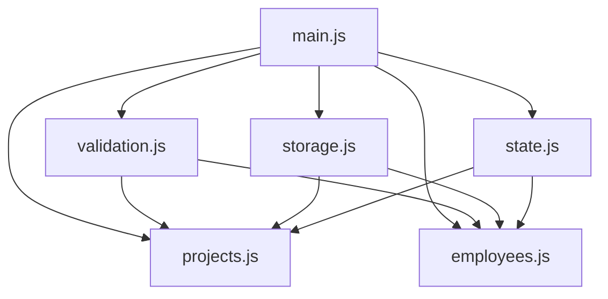
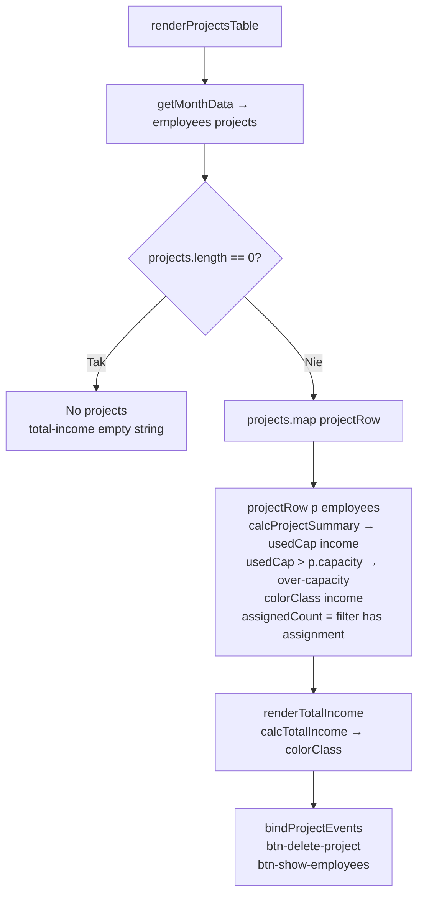
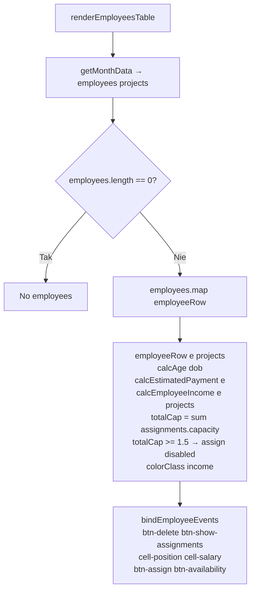
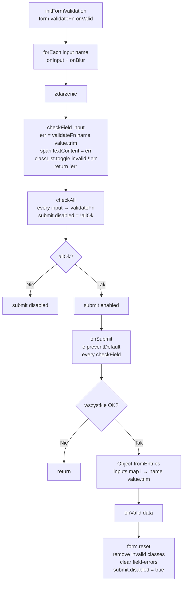
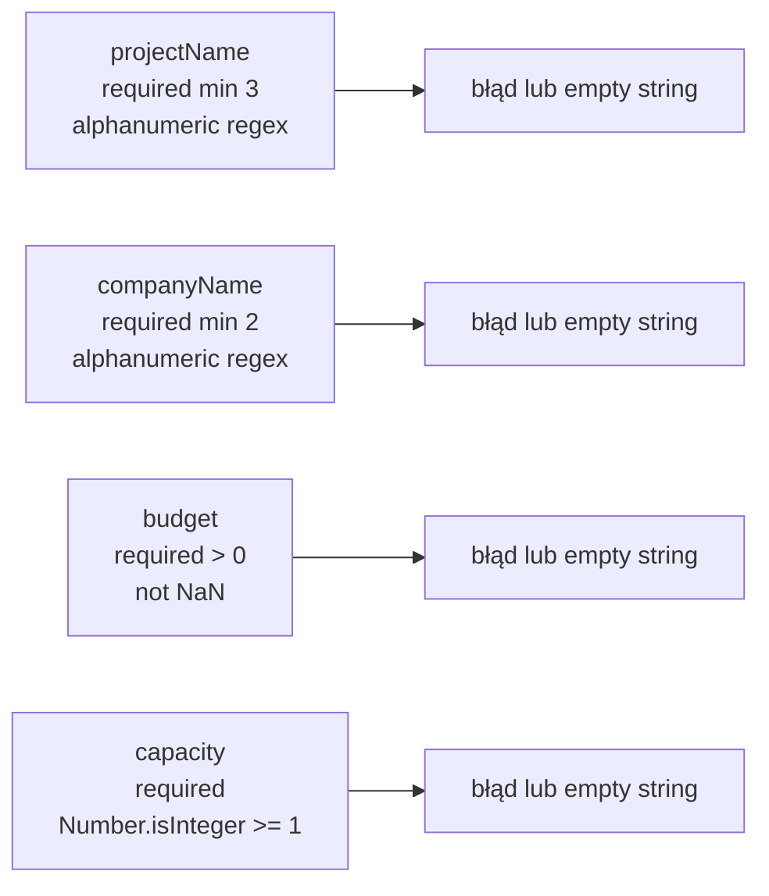
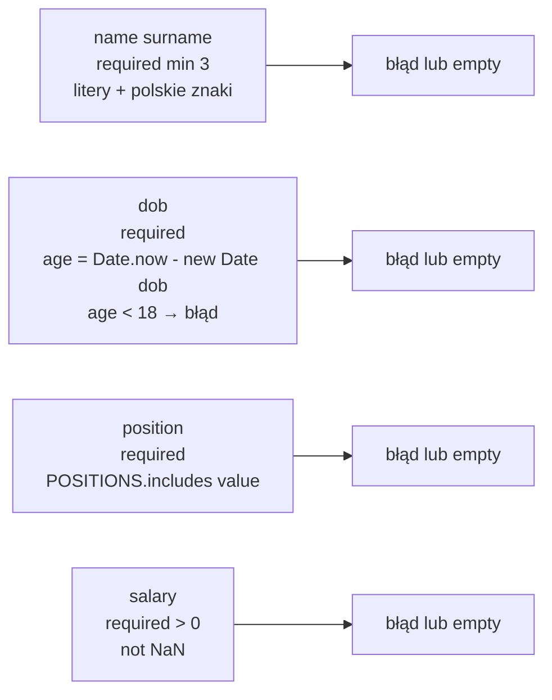
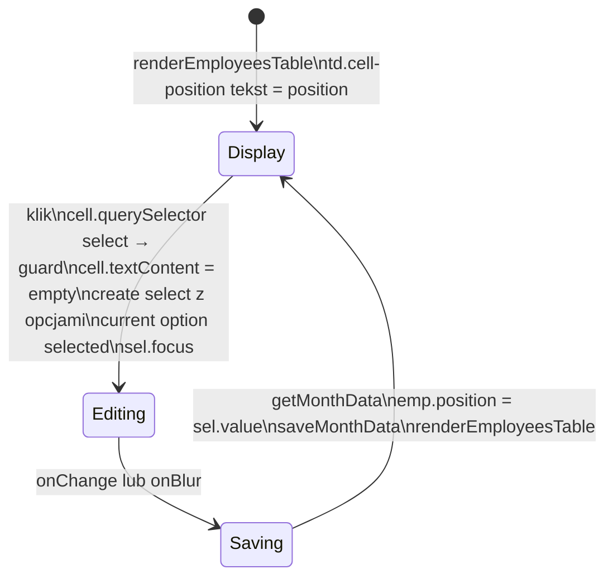
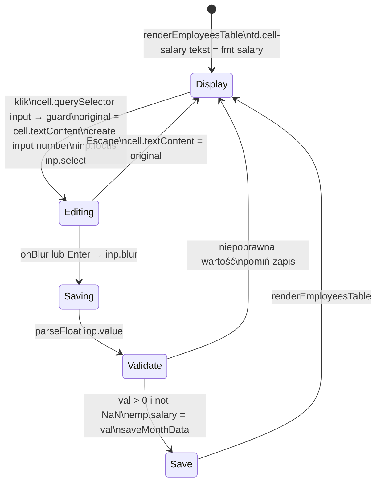
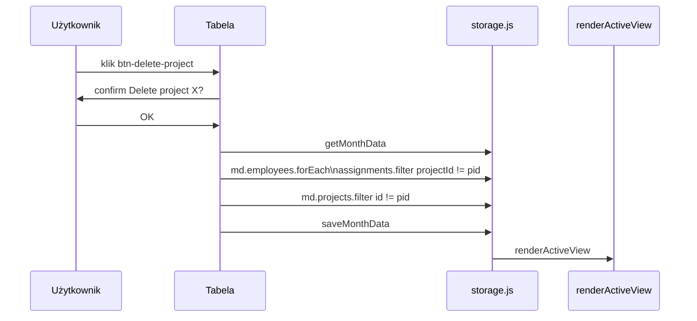
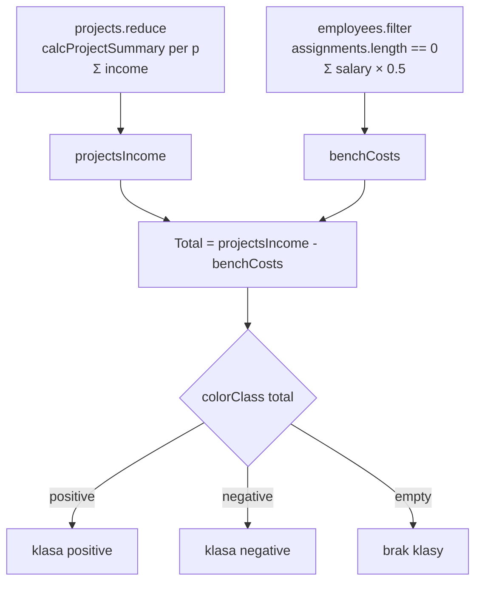

# Etap 2 — Diagramy z implementacji

## 1. Architektura modułów po etapie 2

## 2. renderProjectsTable — pipeline

## 3. renderEmployeesTable — pipeline

## 4. initFormValidation — mechanizm walidacji

## 5. validateProjectField — reguły

## 6. validateEmployeeField — reguły

## 7. inlineEditPosition — stany

## 8. inlineEditSalary — stany

## 9. deleteProject — sekwencja

## 10. calcTotalIncome — składowe

