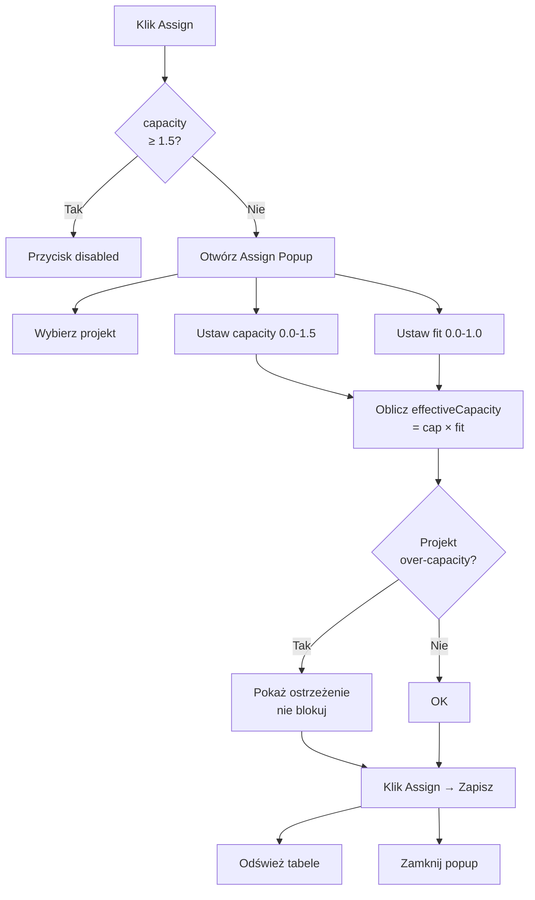
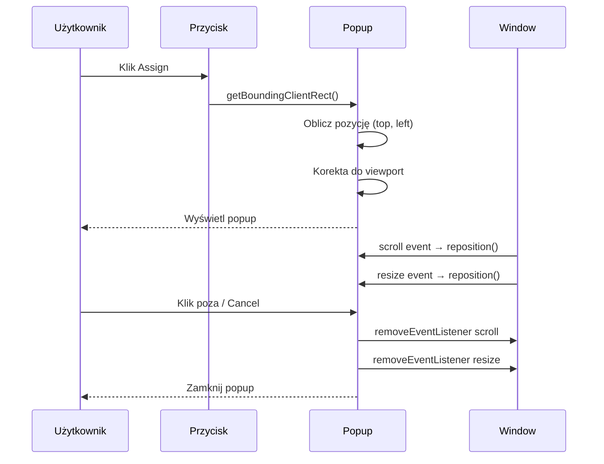
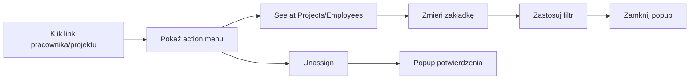
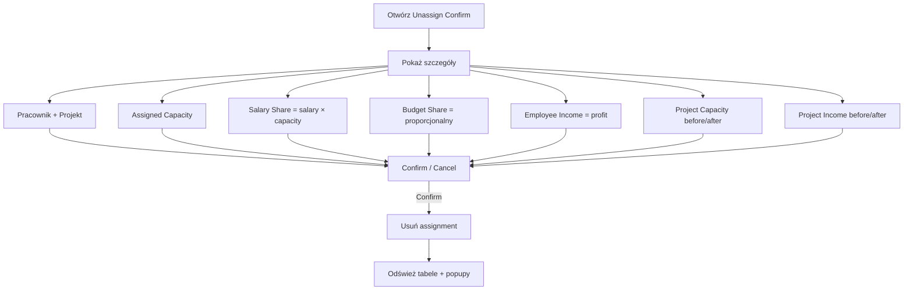
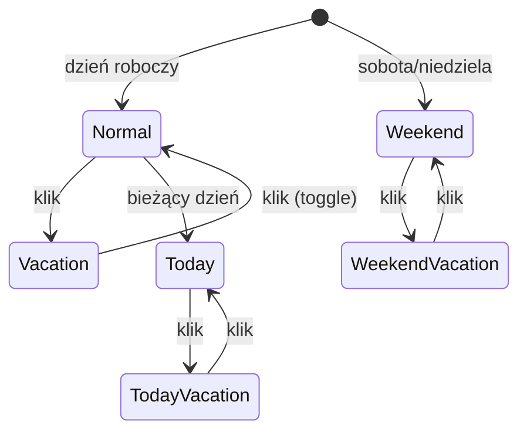
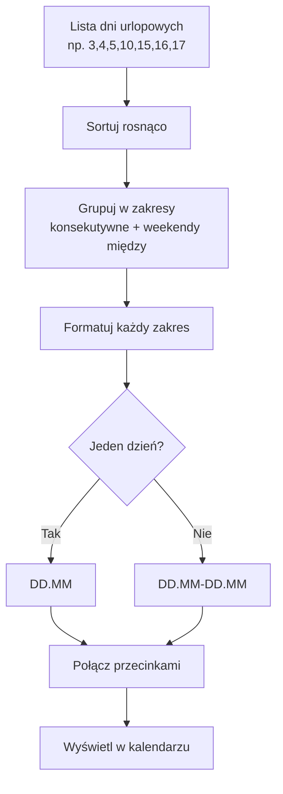
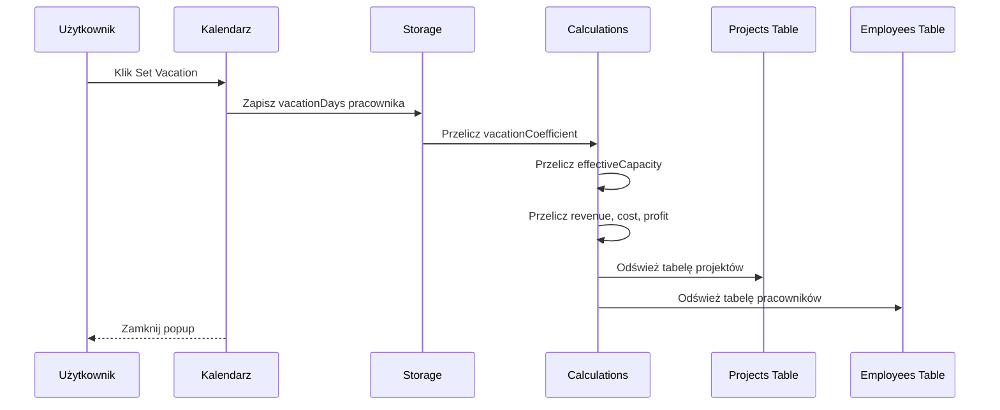

# Etap 3 — Diagramy Mermaid

## 1. Przepływ przypisania pracownika do projektu



## 2. Pozycjonowanie Assign Popup



## 3. Popup Show Employees — struktura

```mermaid
graph TD
    OVERLAY[div.backdrop] --> POPUP[div.popup]
    POPUP --> HEADER[h2 Pracownicy projektu X]
    POPUP --> CLOSE[button ×]
    POPUP --> TABLE[table]
    TABLE --> THEAD[Name | Cap | Fit | Vac | EffCap | Rev | Cost | Profit | Actions]
    TABLE --> TBODY[tr × N pracowników]
    TBODY --> LINK[a.employee-link → action menu]
    TBODY --> EDIT[btn Edit]
    TBODY --> UNASSIGN[btn Unassign]
```

## 4. Action Menu — przepływ



## 5. Unassign — szczegóły finansowe



## 6. Kalendarz urlopowy — stany dnia



## 7. Obliczanie i formatowanie zakresów urlopowych



## 8. Set Vacation — efekt kaskadowy


