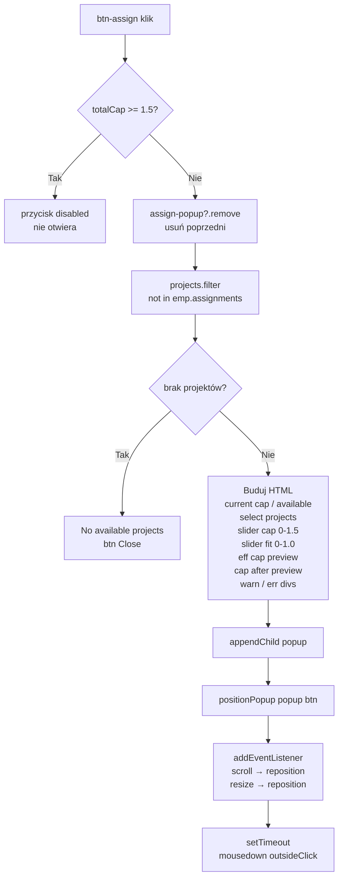
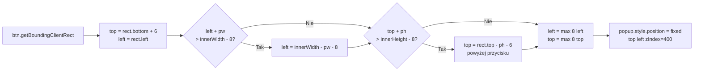
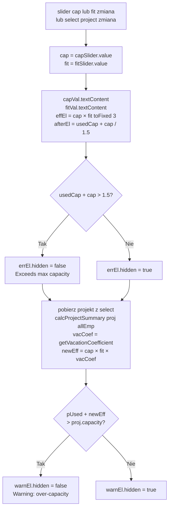
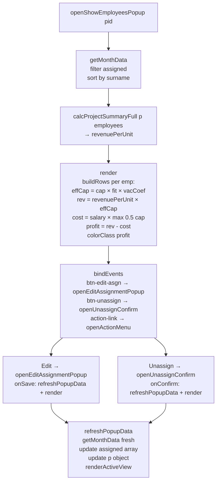
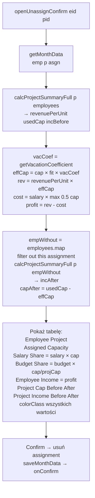
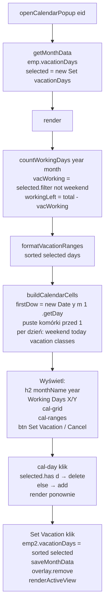
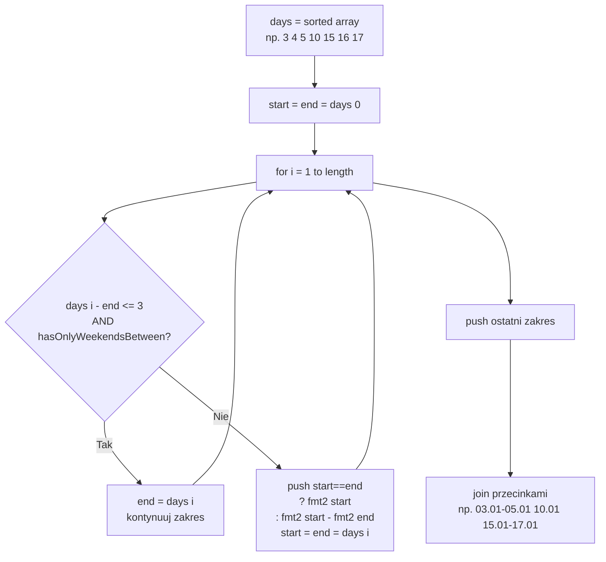
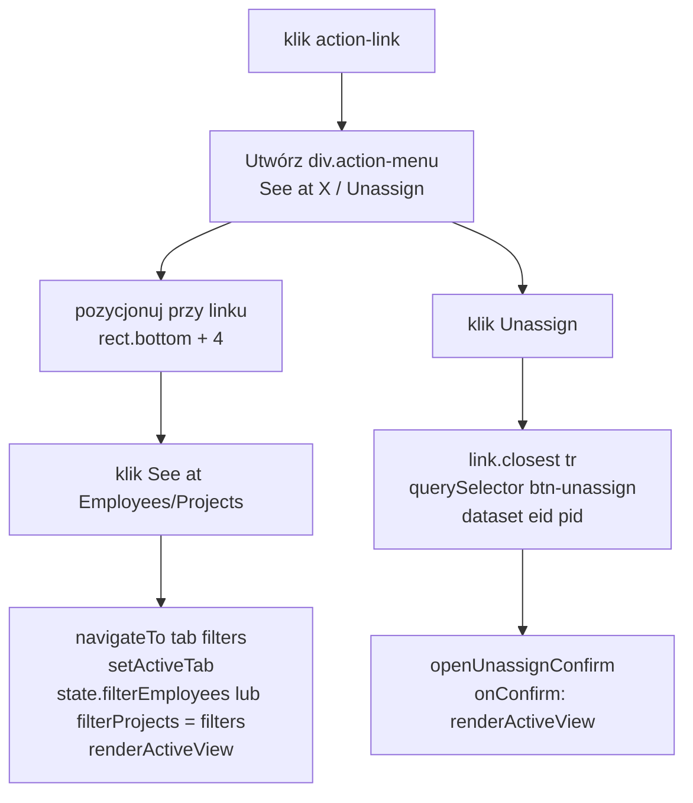

# Etap 3 — Diagramy z implementacji

## 1. Assign Popup — pełny przepływ

## 2. positionPopup — algorytm viewport

## 3. updateSliders — real-time walidacja w Assign Popup

## 4. openShowEmployeesPopup — struktura i odświeżanie

## 5. openUnassignConfirm — obliczenia before/after

## 6. openCalendarPopup — cykl render

## 7. formatVacationRanges — algorytm grupowania

## 8. openActionMenu — nawigacja z filtrem

