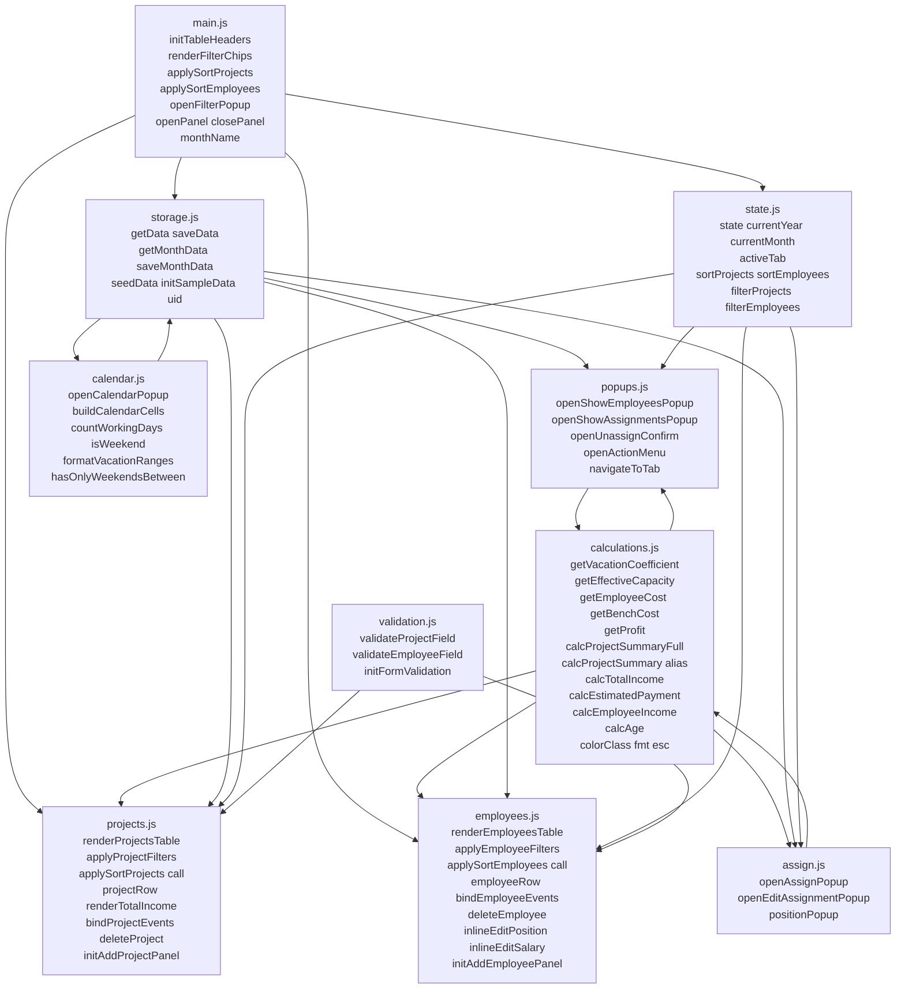
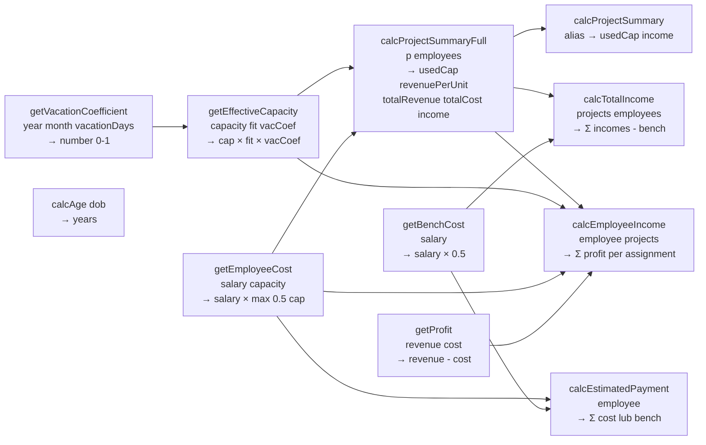
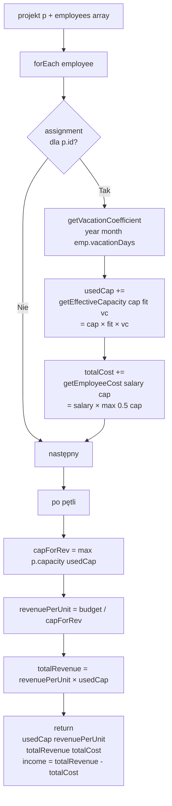
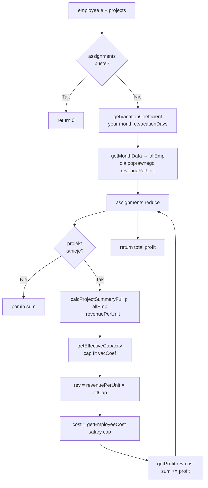
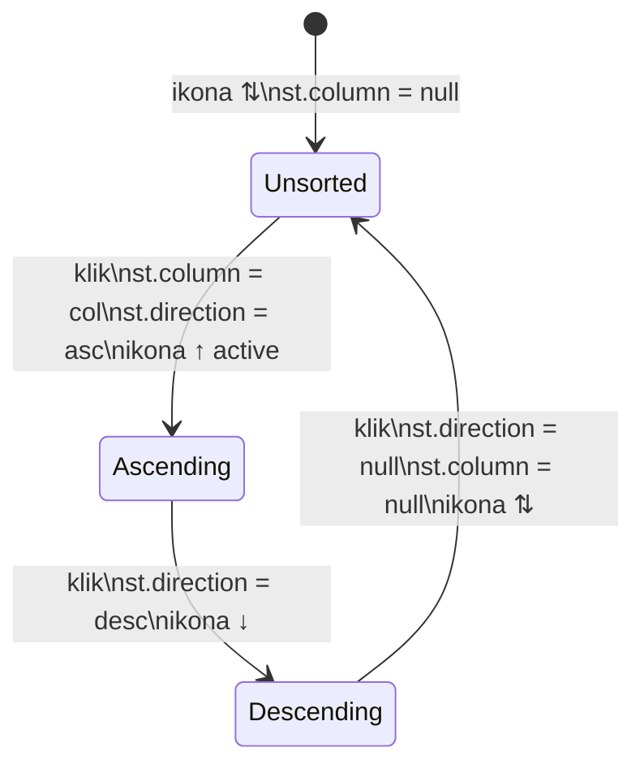
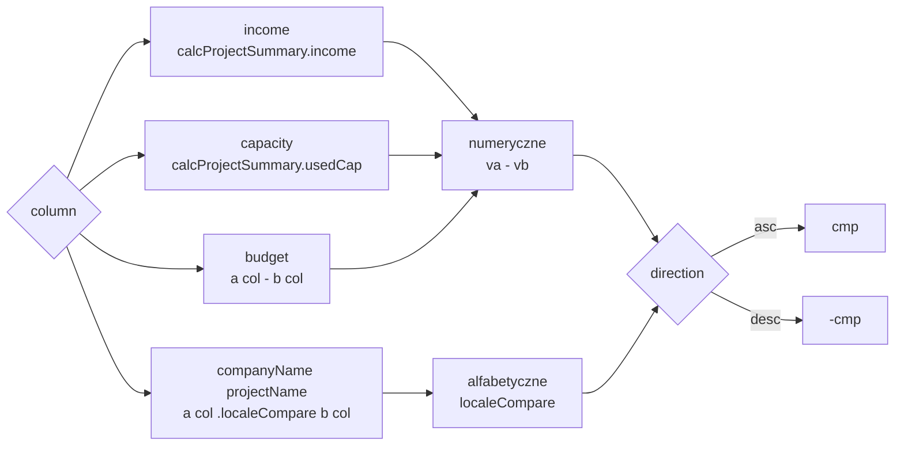
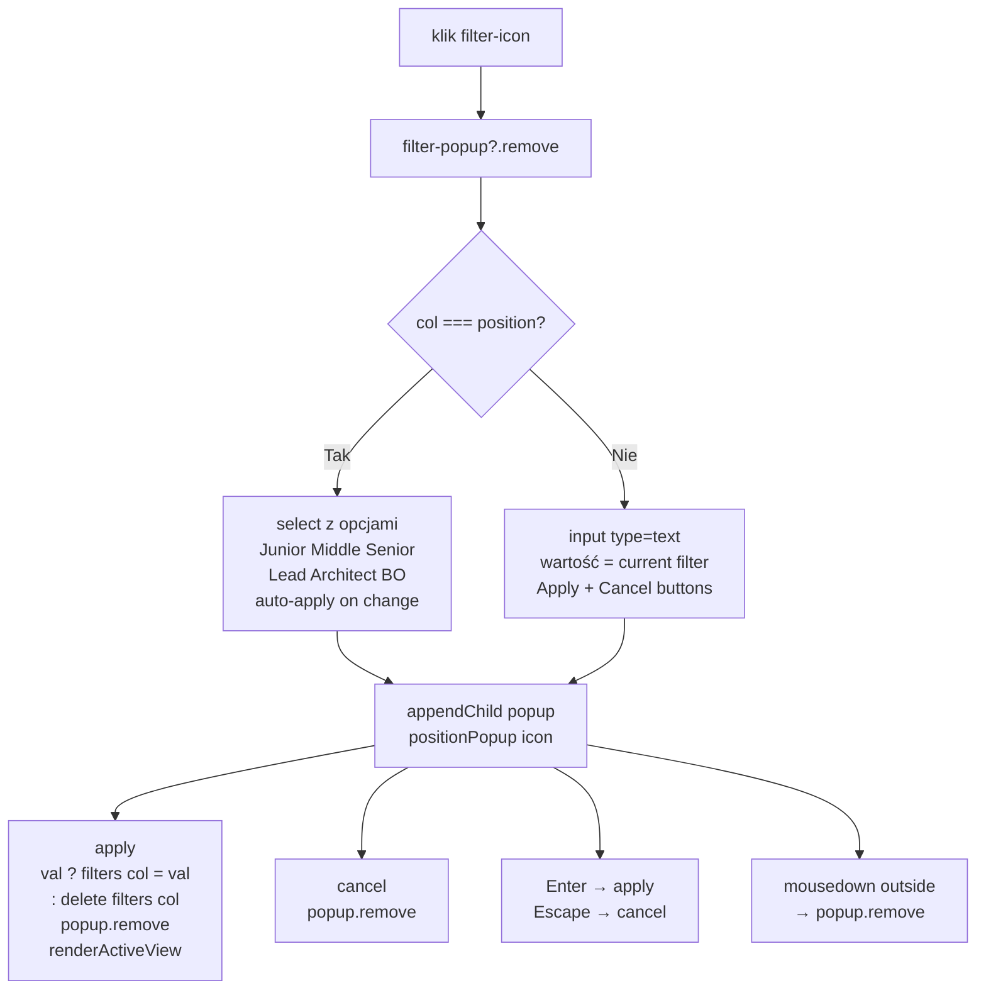
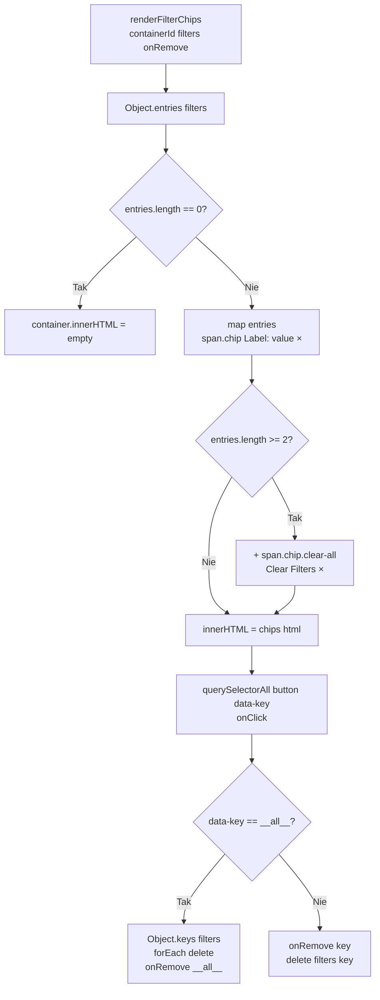
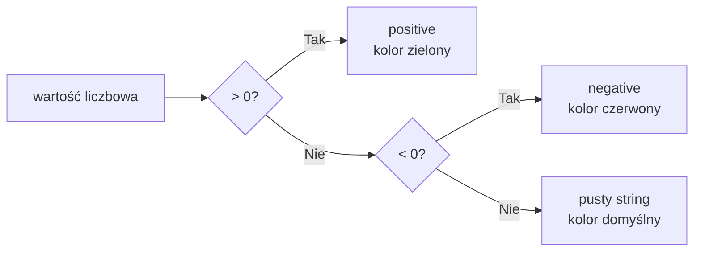
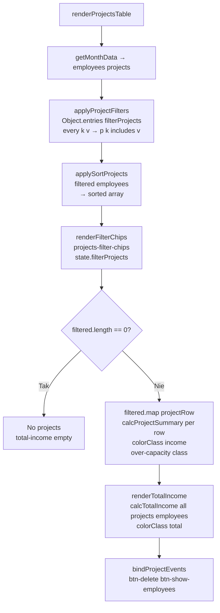

# Etap 4 — Diagramy z implementacji

## 1. Architektura modułów — finalna (etap 4)

## 2. calculations.js — mapa funkcji i zależności

## 3. calcProjectSummaryFull — szczegółowy przepływ

## 4. calcEmployeeIncome — przepływ per assignment

## 5. Sortowanie — cykl stanów i logika

## 6. applySortProjects — wartości sortowania

## 7. Filtrowanie — openFilterPopup

## 8. renderFilterChips — logika chipów

## 9. colorClass — kolorowanie wartości

## 10. Pełny pipeline render tabeli projektów

