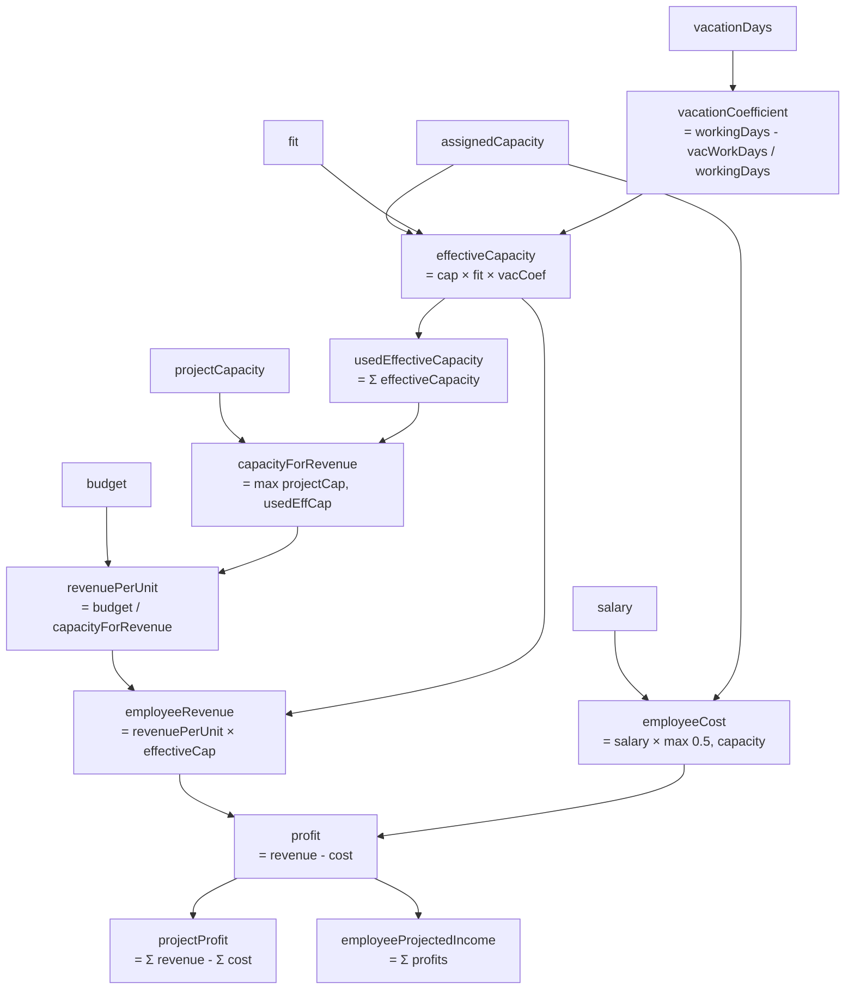
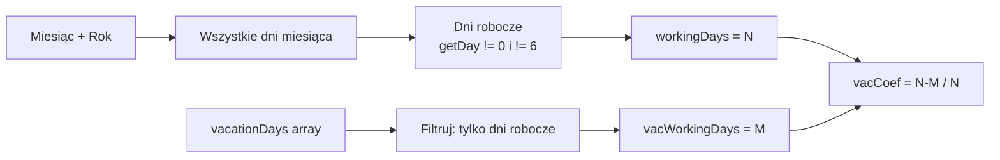
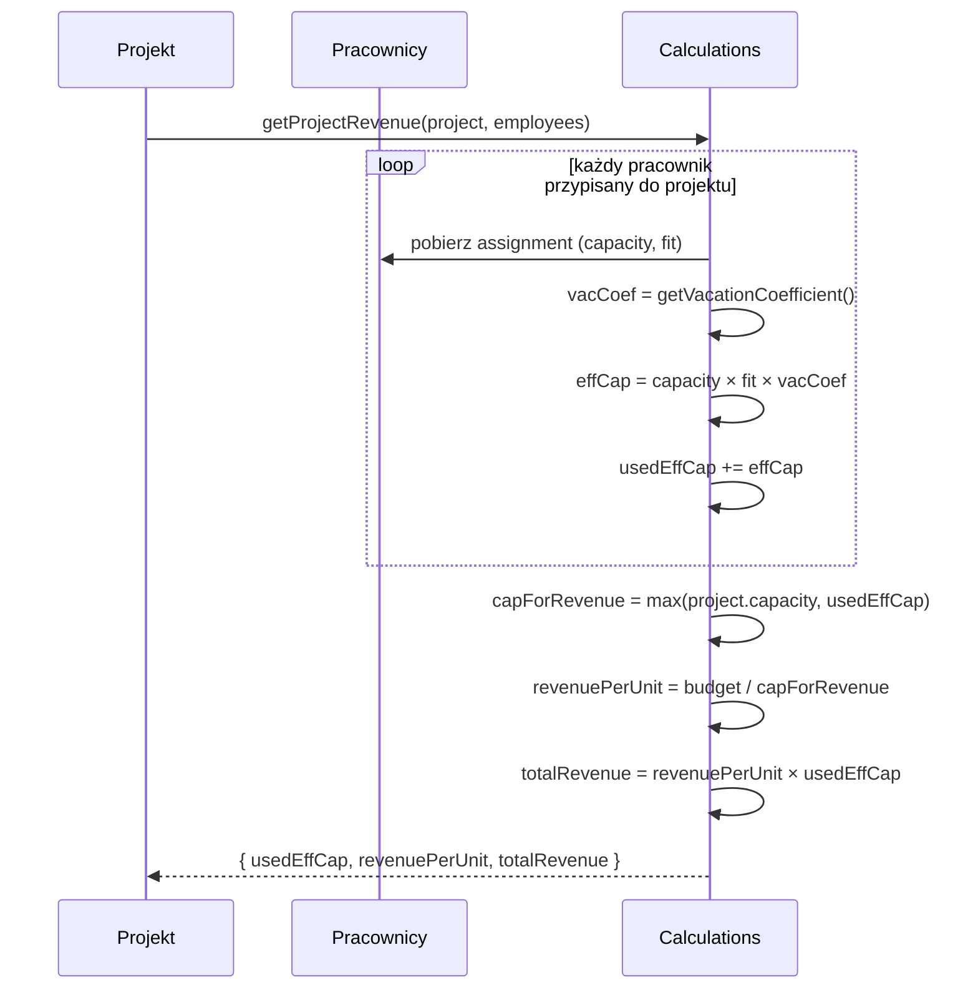
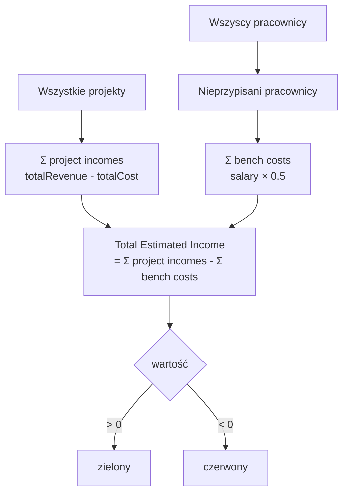
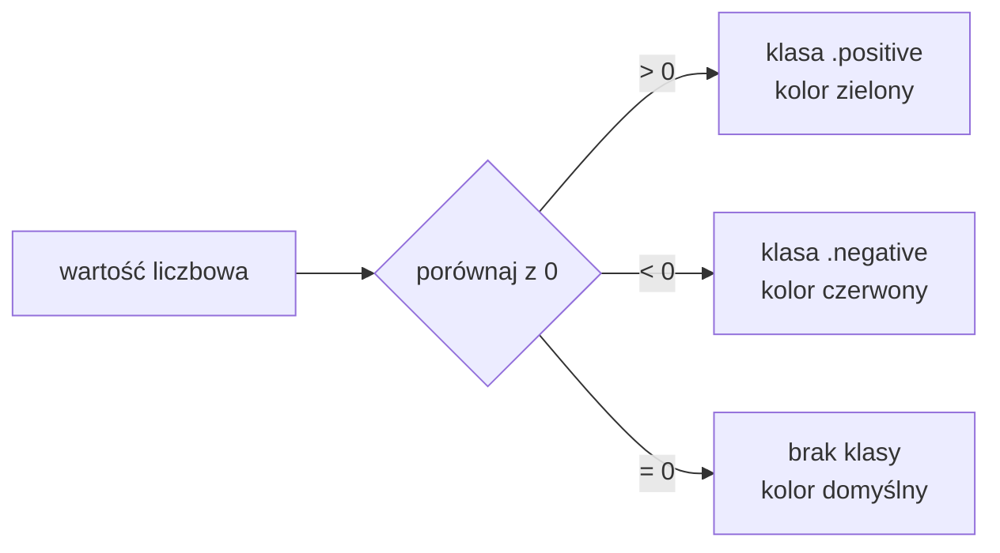
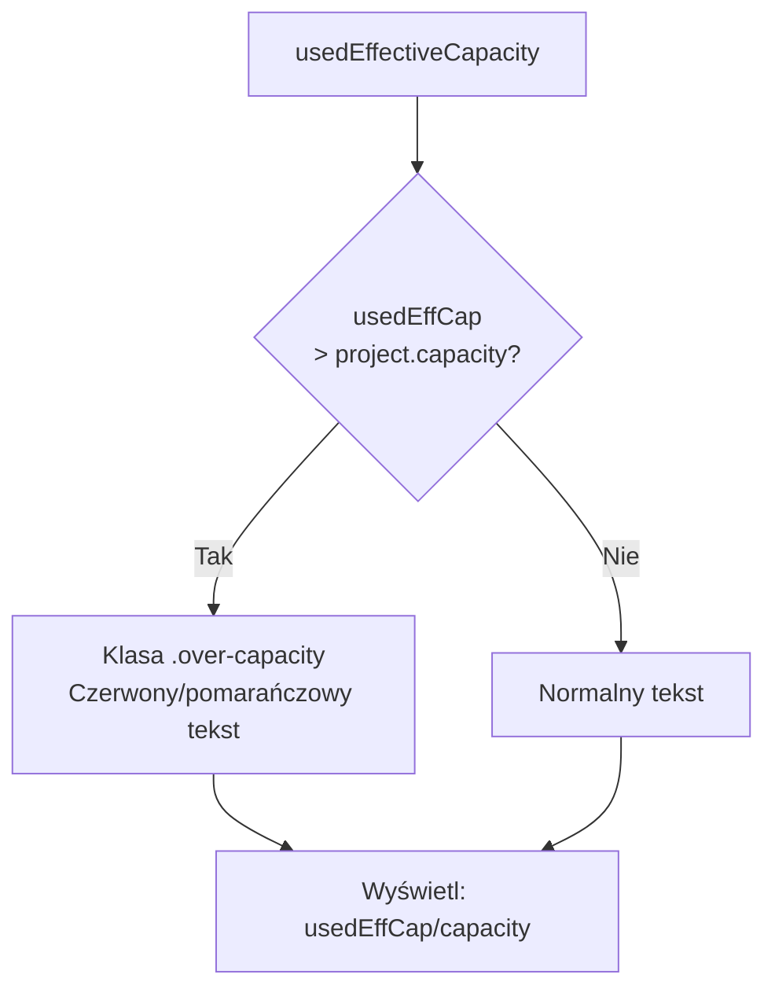
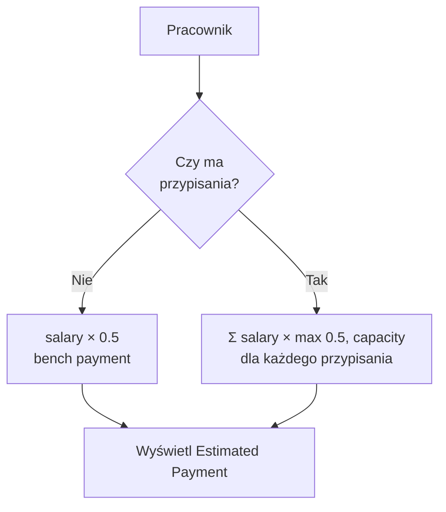

# Etap 4 — Diagramy Mermaid

## 1. Mapa wszystkich obliczeń finansowych

## 2. Vacation Coefficient — obliczanie

## 3. Revenue — przepływ obliczeń dla projektu

## 4. Total Estimated Income — składowe

## 5. Kolorowanie wartości — logika

## 6. Over-capacity projektu

## 7. Estimated Payment pracownika

