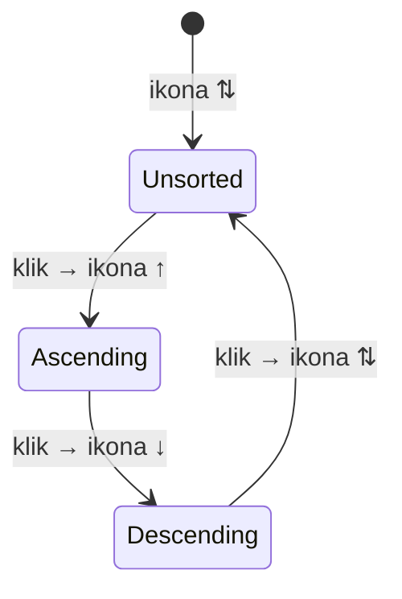
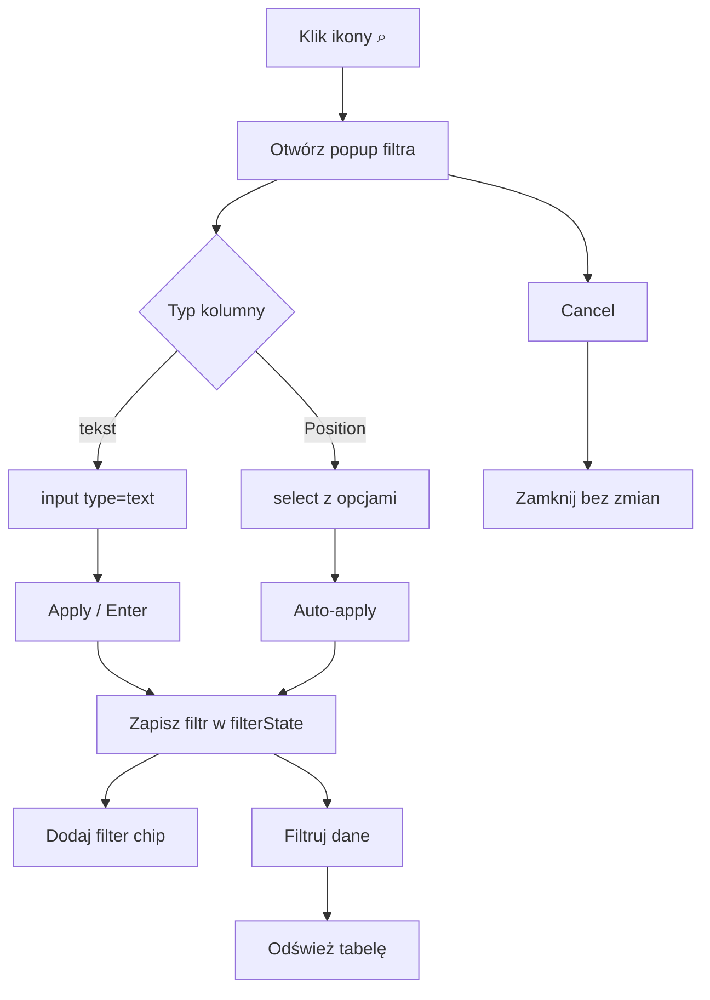
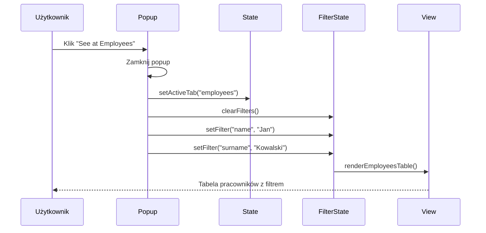
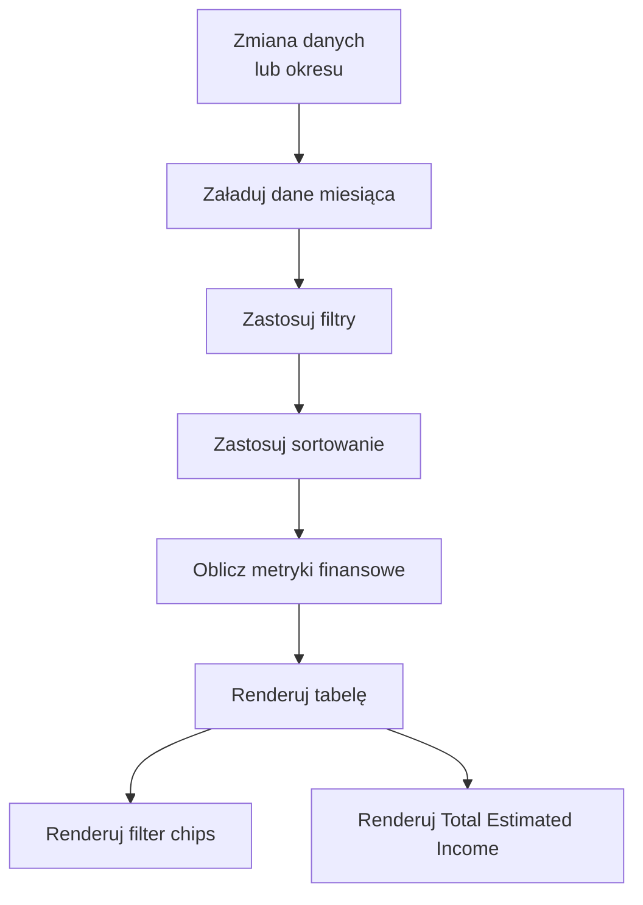
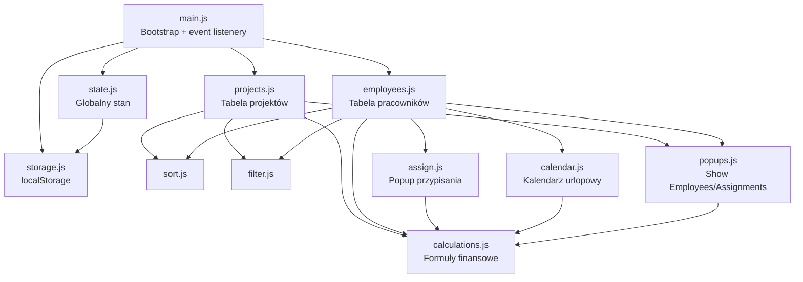
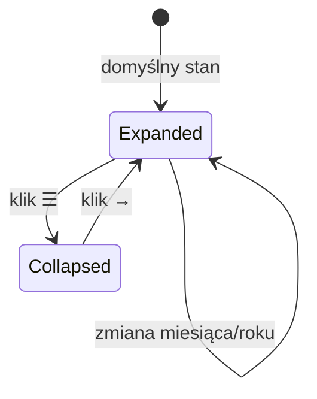
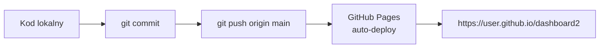

# Etap 5 — Diagramy Mermaid

## 1. Cykl sortowania kolumny



## 2. Przepływ filtrowania



## 3. Filter Chips — zarządzanie

```mermaid
flowchart LR
    FILTERS[filterState\n{col: val, ...}] --> COUNT{Ile filtrów?}
    COUNT -- 1 --> CHIP1[1 chip: Col: val ×]
    COUNT -- 2+ --> CHIPS[N chipów + Clear Filters ×]
    CHIP1 --> REMOVE1[× → usuń filtr]
    CHIPS --> REMOVEX[× na chipie → usuń ten filtr]
    CHIPS --> CLEARALL[Clear Filters → usuń wszystkie]
    REMOVE1 --> RERENDER[Odśwież tabelę]
    REMOVEX --> RERENDER
    CLEARALL --> RERENDER
```

## 4. Nawigacja "See at" — przepływ



## 5. Pełny przepływ danych — od zmiany do renderowania



## 6. Architektura modułów — finalna



## 7. Sidebar — stany



## 8. Deployment — kroki


